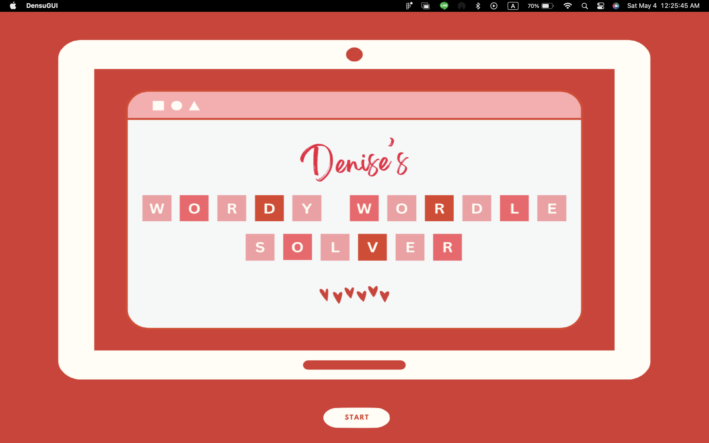
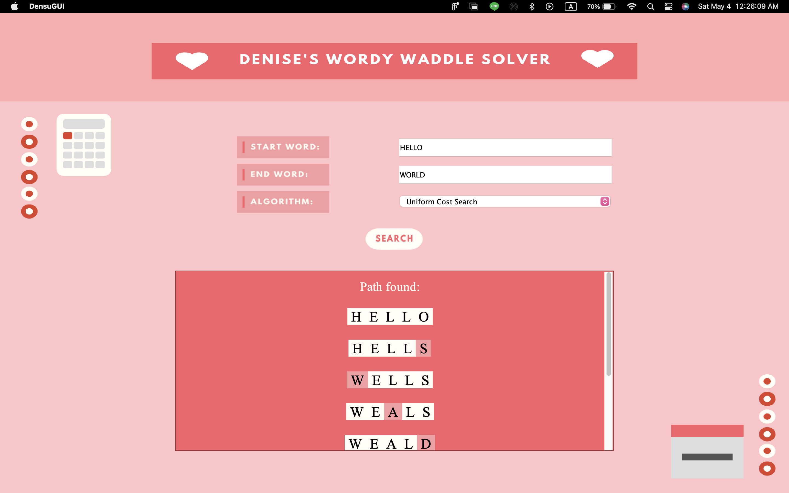

<h2 align="center"> Tugas Kecil 3 IF2211 Strategi Algoritma </h2>
<h1 align="center"> Penyelesaian Permainan Word Ladder Menggunakan Algoritma UCS, Greedy Best First Search, dan A*</h1>

<div align="center">
    
</div>

## Kenalan, yuk!
|   NIM    |                  Nama                  |
| :------: | :------------------------------------: |
| 13522013 |        Denise Felicia Tiowanni         |

## Ini program apa, sih?
Word ladder adalah salah satu permainan kata yang terkenal dimana pemain diberikan dua kata yang disebut sebagai start word dan end word. Untuk memenangkan permainan, pemain harus menemukan rantai kata yang dapat menghubungkan antara start word dan end word tersebut, dimana banyaknya huruf pada start word dan end word selalu sama. Tiap kata yang berdekatan dalam rantai kata tersebut hanya boleh berbeda satu huruf saja. Pada permainan ini,
diharapkan solusi optimal, yaitu solusi yang meminimalkan banyaknya kata yang dimasukkan pada rantai kata. Program ini akan membantu pemain menyelesaikan permainan word ladder dengan memberikan solusi yang optimal.

## Ayo peek struktur programnya :0

```
│
├── bin
│
├── doc
│   └── Tucil3_13522013.pdf
│
├── src
│   ├── assets
│   ├── dictionary.txt
│   ├── Dictionary.java
│   ├── Node.java
│   ├── SearchStrategy.java
│   ├── UCS.java
│   ├── GBFS.java
│   ├── AStar.java
│   ├── Main.java
│   ├── DensuGUI.java
│   ├── run.sh
│   └── run.bat
│
├── test
│   ├── UCS1.png
│   ├── UCS2.png
│   ├── UCS3.png
│   ├── UCS4.png
│   ├── UCS5.png
│   ├── UCS6.png
│   ├── GBFS1.png
│   ├── GBFS2.png
│   ├── GBFS3.png
│   ├── GBFS4.png
│   ├── GBFS5.png
│   ├── GBFS6.png
│   ├── AStar1.png
│   ├── AStar2.png
│   ├── AStar3.png
│   ├── AStar4.png
│   ├── AStar5.png
│   └── AStar6.png
│
└── README.md
```

<div align="center">
    
</div>

## Bagaimana menjalankan file executable?
1. Clone repository ini dengan 
    ```
    git clone https://github.com/denoseu/Tucil3_13522013.git
    ```
2. Buka folder repository pada terminal.
3. Pindah ke direktori *src* dengan `cd src`
4. Apabila menggunakan Windows, skip ke langkah 5. Bagi pengguna MacOS/Linux, masukkan kedua command berikut pada terminal:
    ```
    chmod +x run.sh
    ./run.sh
    ```
5. Bagi pengguna Windows, masukkan command berikut pada terminal:
    ```
    run.bat
    ```
6. Klik enter/return.
7. Jendela program dengan GUI seharusnya muncul dan bisa langsung digunakan.

## Cara pakainya gimana, nih?
1. Setelah windows GUI muncul, klik tombol start.
2. Masukkan start word dan end word.
3. Pilih algoritma yang diinginkan (UCS, G-BFS, ataupun A*).
4. Klik tombol search.
5. Hasil akan keluar, dan apabila ingin mencari lagi, cukup replace start word, end word, dan algoritma yang sebelumnya menjadi yang terbaru.

<br>
<div align="center">
    
</div>
